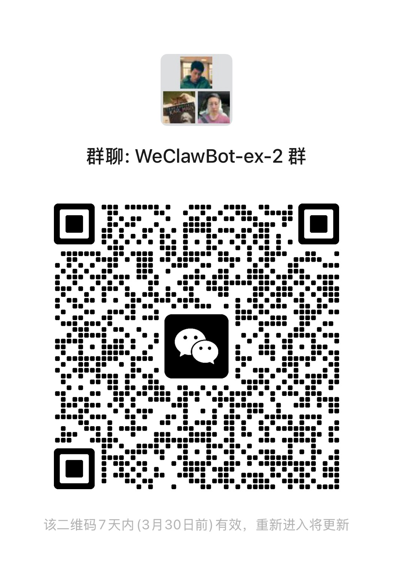

# WeClawBot-ex

[简体中文](./README.zh_CN.md)

Multi-account management layer for **WeChat ClawBot** (the official WeChat AI bot plugin by Tencent).

WeClawBot-ex is a productized fork of the official `@tencent-weixin/openclaw-weixin` plugin. The upstream plugin already has the runtime foundation for multiple account sessions; WeClawBot-ex adds a local web console, QR login management, channel diagnostics, and a distribution-friendly operator workflow.

## What This Adds Over the Official ClawBot

| | Official `openclaw-weixin` | WeClawBot-ex |
|---|---|---|
| Multi-account runtime | Supported, mainly via CLI workflow | Supported, with one local web console |
| QR login experience | Terminal output | Browser QR with live status cards |
| Account visibility | Mainly logs and local state | Aggregated dashboard and relogin actions |
| Cooldown diagnostics | Manual inspection | Built-in `-14` visibility |
| Session isolation | Requires manual `dmScope` configuration | Explicitly guides `per-account-channel-peer` |

## Current Status

The current public release supports:

- multiple WeChat accounts connected to one OpenClaw Gateway
- one WeChat account mapped to one OpenClaw agent by default
- a local control console for QR login and channel management
- account-level DM session isolation via `dmScope=per-account-channel-peer`
- auto-triggered channel reload after QR confirmation, with manual restart fallback

Older shared-agent test data is not migrated in this release. Reconnect old accounts if you are upgrading from an earlier private build.

## Console Preview


## Quick Start

### Prerequisites

- Node.js >= 22
- [OpenClaw](https://docs.openclaw.ai/install) installed (`openclaw` CLI available)

### Install

```bash
git clone https://github.com/ImGoodBai/WeClawBot-ex.git
cd WeClawBot-ex
openclaw plugins install .
```

### Naming

For compatibility, the current release still uses these runtime identifiers:

- Product / repo name: `WeClawBot-ex`
- Plugin package + plugin entry key: `molthuman-oc-plugin-wx`
- Channel config key: `channels.openclaw-weixin`

This is expected for the current version. A mixed-name log does not mean the wrong repository was installed.

### Run

For the default experience, no extra config is required after install:

```bash
openclaw gateway
```

Then open **http://127.0.0.1:19120/**.

### Recommended Config

If you want to pin the isolation mode explicitly, add this to your OpenClaw config:

```json
{
  "session": {
    "dmScope": "per-account-channel-peer"
  },
  "channels": {
    "openclaw-weixin": {
      "agentBinding": {
        "maxAgents": 20
      }
    }
  }
}
```

### Use

1. Start your OpenClaw Gateway
2. Open **http://127.0.0.1:19120/**
3. Click **Add WeChat Channel** — scan the QR code with WeChat
4. After scan success, wait a few seconds for auto refresh
5. If the new account still does not come online, run `openclaw gateway restart`
6. Send a message from that WeChat account — the bound AI agent replies

Repeat step 3 for each additional WeChat account.

## FAQ And Architecture

- FAQ: [docs/faq.md](./docs/faq.md)
- Architecture and isolation boundary: [docs/architecture.md](./docs/architecture.md)

## Troubleshooting

- `WARNING: Plugin "... contains dangerous code patterns"` is currently warn-only in OpenClaw. It is a scanner warning, not the install blocker.
- `npm install failed` needs the full npm stderr before the root cause can be confirmed.
- Check `node -v` first. This plugin requires Node.js `>= 22`.
- Check `openclaw --version` next. Older OpenClaw builds may be incompatible with this plugin revision.
- If the plugin installs but the console does not open, verify `channels.openclaw-weixin.demoService.enabled=true` and restart Gateway.
- If QR login succeeds but the new account does not receive messages, first wait for auto refresh, then use the manual restart command shown in the diagnostics panel.

## Quality Gate

Run these before opening or merging a change:

```bash
npm run test:unit
npm run test:smoke
npm run test:gate
npm run test:gate:full
```

Current automated coverage focuses on:

- config-triggered channel reload and manual fallback
- account snapshot / isolation diagnostics
- control page render smoke
- local demo service health
- mock QR login flow without real WeChat devices

`test:gate` is the current default closeout gate for this standalone repo.
`test:gate:full` additionally runs `typecheck`, which still depends on upstream-derived imports being fully self-contained.

## How It Works

```
WeChat User A -> Weixin Account A -> Agent A
WeChat User B -> Weixin Account B -> Agent B
WeChat User C -> Weixin Account C -> Agent C
                             |
                             └──< Reply to each WeChat user
```

- Fork of the official `@tencent-weixin/openclaw-weixin` plugin (v1.0.2)
- Extends the QR login module to support concurrent multi-session management
- Adds a local web console (`src/service/`) for visual channel management
- Each WeChat account gets isolated DM sessions when `dmScope=per-account-channel-peer`
- Each stable WeChat user is bound to one dedicated OpenClaw agent by default
- Agent workspace is separated by agent id
- Tool/runtime side effects are still shared at the host level

If you are specifically evaluating data isolation, read [docs/architecture.md](./docs/architecture.md). The short version is:

- default mode: one WeChat account -> one dedicated agent
- compatibility fallback: shared `main` agent only when dedicated binding cannot be completed
- future stage: stronger workspace/tool/runtime isolation

## Maintenance Boundary

- The upstream protocol/runtime layer is treated as frozen
- Ongoing changes should stay in our own layer: `src/service/`, plugin packaging, and docs
- Avoid editing upstream-derived files unless a compatibility fix is unavoidable

## Roadmap

### Stronger Isolation

- [x] One WeChat account -> one OpenClaw agent
- [ ] Explicit tool / runtime side-effect isolation
- [ ] Harder tenant boundary enforcement

### Commercial Distribution

- [ ] Shareable QR codes for external distribution
- [ ] Paid entry points per WeChat channel
- [ ] Plugin-side billing and commercial distribution workflow

## Common Questions

### Does the official plugin already support multiple WeChat accounts?

At the runtime layer, yes. The official plugin already has multi-account account storage and monitor startup logic. WeClawBot-ex focuses on management UX, QR workflow visibility, diagnostics, and operational packaging.

### Is data fully isolated today?

Not fully. One WeChat account now maps to one dedicated OpenClaw agent by default, and the agent workspace is separated by agent id, but tool/runtime side effects are still shared at the host level.

### Is one WeChat account mapped to one agent today?

Yes. That is now the default behavior of this repo. Shared-agent mode only remains as a compatibility fallback when dedicated binding cannot be completed.

## License

MIT — see [LICENSE](./LICENSE) and [NOTICE](./NOTICE) for upstream attribution.

## WeChat Group

Scan the QR code below to join the WeChat ClawBot exchange group:


